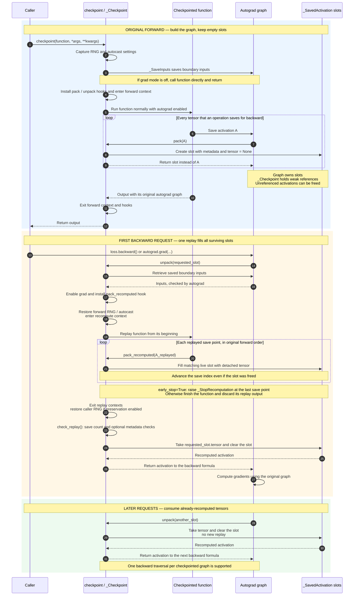
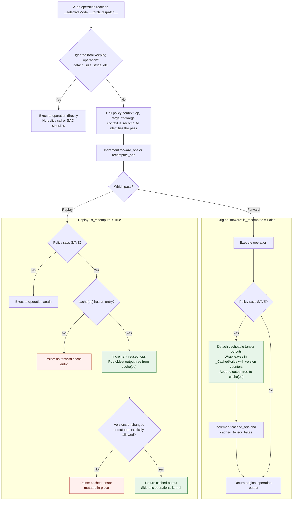

# Activation checkpointing, with the machinery exposed

This is a standalone teaching implementation of PyTorch's modern, non-reentrant
activation checkpoint. It uses core autograd and dispatcher primitives, but the
custom path never calls `torch.utils.checkpoint.checkpoint`.

It is intentionally more realistic than the common custom `autograd.Function`
example. That simple reentrant formulation runs forward under `no_grad()` and
reruns the entire function in backward. Current PyTorch recommends the
non-reentrant implementation, whose interesting mechanism is
`saved_tensors_hooks`.

## The central trick

During a normal forward pass, backward formulas call `save_for_backward` for
the tensors they will need later. The custom checkpoint installs hooks that
replace every such tensor with a tiny `_SavedActivation` slot:

The sequence below separates the original forward, the first backward tensor
request, and later requests. **Replay fills the slots in forward save order;
backward retrieves them in the order its gradient formulas need them.**



For example, in `y = x.sin().cos()`, `sin` saves `x` and `cos` saves
`sin(x)`. Forward creates two empty slots. Backward first needs the second
slot to differentiate `cos`; that request triggers replay, which fills slot 0
and then slot 1. Backward consumes slot 1, then slot 0 to differentiate `sin`.
Early stopping can interrupt replay before the final `cos` output is computed:
its saved input is already available.

`_SaveInputs` anchors only the checkpoint boundary inputs to the outer
autograd graph. On the first unpack, the function is replayed with grad mode
enabled. A second set of saved-tensor hooks catches the replayed activations and
matches them, in order, to the slots from the first pass.

The implementation keeps the less-obvious production behavior that matters for
correctness:

- CPU and accelerator RNG states are forked and restored, so dropout produces
  the same mask during replay without advancing the caller's RNG twice.
- CPU and accelerator autocast settings are replayed.
- Replay verifies the number and shape/dtype/device metadata of saved tensors.
- An internal exception stops replay immediately after the final needed save
  point, instead of necessarily finishing the function.
- Inputs are retained by an autograd node rather than a plain Python closure.

## Selective activation checkpointing

Selective activation checkpointing (SAC) is a layer around the same replay.
Two paired `TorchDispatchMode`s intercept individual ATen operations:

1. The forward mode asks a policy whether an operation should be saved or
   recomputed. Saved outputs go into a per-`OpOverload` FIFO cache.
2. The replay mode asks the same policy with `is_recompute=True`. It either runs
   the operation or pops the corresponding forward result from the cache.
3. Cached tensors retain their version counter. If later code mutates one
   in-place, replay fails instead of silently using a corrupted result.

`MUST_*` versus `PREFER_*` matters to compiler partitioners in full PyTorch. In
this eager-only implementation they have the same runtime behavior, but both
forms remain in the API so the policy reads like the real one.

The demo caches the two batched matrix multiplies in attention while replaying
the cheaper operations:

```python
sac_contexts = create_selective_checkpoint_contexts(
    [torch.ops.aten.bmm.default]
)
output = checkpoint(block, x, context_fn=lambda: sac_contexts)
```

### How SAC changes the replay

AC's slots represent **tensors autograd saves for backward**. SAC's separate
cache holds **outputs of operations selected by the policy**. These are two
different stores: SAC changes how replay obtains operation outputs, while AC
still reconstructs the tensors needed by the original backward graph.

Both contexts returned by `create_selective_checkpoint_contexts` are instances
of `_SelectiveMode`, sharing one cache. The forward context is entered around
the original function; the recompute context is entered around its replay.



Here, SAVE means `MUST_SAVE` or `PREFER_SAVE` (or boolean `True`);
RECOMPUTE means either recompute enum value (or boolean `False`). Statistics
count intercepted operations, so `recompute_ops` includes operations whose
kernels were skipped using the cache.

For `sigmoid(x @ w1 @ w2)` with `aten.mm.default` selected:

| Stage | First matrix multiply | Second matrix multiply | Sigmoid |
|---|---|---|---|
| Original forward | Compute A; append A to `cache[mm]` | Compute B; append B to `cache[mm]` | Compute normally |
| Cache after forward | A is first in the queue | B is second in the same queue | No SAC entry |
| Replay | Pop A; skip kernel | Pop B; skip kernel | Compute again |

The cache is FIFO **per concrete operation overload**, not per source line.
AC's replay hooks still observe autograd save points around those operations,
including when a cached output supplies the result. Once the last save point
is reached, AC can stop replay. SAC therefore trades memory for less replay
compute: selected outputs stay alive across forward and backward.

## API walkthrough: who calls what?

The public entry point is `checkpoint`. You supply the computation; the wrapper
arranges its forward execution and a later replay if backward needs saved tensors:

```text
checkpoint(function, *args, **kwargs)
    |
    +-- Forward: call function(*args, **kwargs)
    |
    +-- Prepare recompute_fn for later
         |
         +-- First backward tensor request triggers recompute_fn(...)
              |
              +-- Call the same function under replay settings
```

### `function`: your computation

`function` is an ordinary Python callable: a function, an `nn.Module`, or a bound
method. It contains the actual computation and needs no checkpoint-specific code.

```python
def block(x, weight, *, scale):
    return (x @ weight).sin() * scale

output = checkpoint(block, x, weight, scale=2)
```

For this call, the wrapper receives:

| Parameter | Value |
|---|---|
| `function` | `block` |
| `args` | `(x, weight)` |
| `kwargs` | `{"scale": 2}` |

### `checkpoint()`: wrap one invocation

The wrapper prepares the input state, execution settings, and hooks, then returns
the normal function output:

```text
checkpoint(function, *args, **kwargs):
    forward_context, recompute_context = context_fn()
    capture RNG and autocast settings
    define recompute_fn for later
    retain checkpoint inputs through _SaveInputs
    create _Checkpoint state with recompute_fn and those inputs

    install state.pack and state.unpack hooks:
        enter forward_context:
            output = function(*args, **kwargs)

    return output
```

It does not run backward or immediately recompute the function. The output keeps
its original autograd graph; that graph's saved-tensor hooks keep the checkpoint
state accessible for backward. With grad mode disabled, the implementation calls
the function directly without installing checkpoint hooks.

`_SaveInputs` is an internal autograd node that retains the boundary arguments.
Direct tensor arguments use `save_for_backward`, preserving autograd's input
version checks. A dummy tensor requiring gradients ensures this node exists even
when gradients are needed only for parameters captured by the function.

### `recompute_fn`: prepare the environment and call `function` again

You do not supply `recompute_fn`. It is a nested function created inside
`checkpoint`, capturing your callable, the execution settings, and the recompute
context. Its structure is:

```text
recompute_fn(saved_kwargs, *saved_args):
    enter RNG fork, if preservation is enabled:
        restore the forward RNG state, if preservation is enabled

        restore forward autocast settings:
            enter recompute_context:
                function(*saved_args, **saved_kwargs)

    # Leaving the RNG fork restores the caller's RNG state.
```

The input-saving node stores the keyword dictionary before the positional
arguments, which explains the internal signature `saved_kwargs, *saved_args`.
Your callable still receives its ordinary argument layout.

The replay output is ignored. **Replay's useful result is the saved tensors
captured by its hooks**, which fill the original activation slots. With early
stopping enabled, an internal exception may terminate this call before the
function returns; the context managers still restore the execution environment.

### `_Checkpoint`: connect forward saves to backward requests

This internal object holds the slots, input-saving node, replay status, and
replay callable. `state.replay` is the `recompute_fn` created above.

| Method | Trigger | Responsibility |
|---|---|---|
| `pack(tensor)` | An operation saves a tensor during forward | Return an empty activation slot |
| `unpack(slot)` | Backward requests a saved tensor | Replay once if needed, then return and clear the slot's tensor |
| `pack_recomputed(tensor)` | An operation saves a tensor during replay | Fill the corresponding original slot |
| `check_replay()` | Replay finishes or stops early | Check save counts and optional tensor metadata |

The call chain during backward is:

```text
loss.backward()
    -> autograd requests a saved tensor
    -> state.unpack(slot)
        -> retrieve retained checkpoint inputs
        -> enable gradients and install replay hooks
        -> state.replay(...)                 # recompute_fn
            -> function(...)                 # Your computation runs again
                -> state.pack_recomputed(tensor)
                                             # Fill slots at save points
        -> catch the internal early-stop exception, if raised
        -> check_replay()
        -> return the requested tensor to the original backward graph
```

Later calls to `unpack` consume the already-filled slots without another replay.
The gradient formulas remain those of the original forward graph.

### `context_fn`: customize the two passes, including SAC

`context_fn` is a factory returning a pair of context managers:

```python
forward_context, recompute_context = context_fn()
```

The default contexts do nothing. For SAC, supply a factory that creates paired
dispatch modes with a shared cache:

```python
from functools import partial

output = checkpoint(
    block,
    x,
    weight,
    scale=2,
    context_fn=partial(
        create_selective_checkpoint_contexts,
        [torch.ops.aten.mm.default],
    ),
)
```

`checkpoint` calls the factory once per invocation. The forward context caches
selected operation outputs; the recompute context reuses those outputs during
replay. Creating the pair inside the factory gives each checkpoint invocation
its own cache.

`create_selective_checkpoint_contexts` accepts either a list of concrete
operation overloads, as above, or a callable policy:

```python
def policy(ctx, op, *args, **kwargs):
    # ctx.is_recompute is False in forward and True during replay.
    if op == torch.ops.aten.mm.default:
        return CheckpointPolicy.MUST_SAVE
    return CheckpointPolicy.PREFER_RECOMPUTE
```

Here, `args` and `kwargs` belong to the intercepted operation. The helper also
accepts `stats=SelectiveCheckpointStats()` for instrumentation and
`allow_cache_entry_mutation=False`, which rejects mutated cached tensors by
default.

### Checkpoint options

| Option | Default | Effect |
|---|---|---|
| `preserve_rng_state` | `True` | Reproduce forward randomness during replay, then restore the caller's RNG state |
| `context_fn` | Two no-op contexts | Supply forward and recompute contexts, such as SAC dispatch modes |
| `early_stop` | `True` | Stop replay after the last recorded save point |
| `determinism_check` | `True` | Compare replayed tensor shape, dtype, and device; does not compare numerical values |
| `stats` | `None` | Optionally supply a `CheckpointStats` instance to inspect intercepted saves and replay activity |

Saved-tensor count checks still run when `determinism_check=False`. These option
names belong to `checkpoint`; other keyword arguments are forwarded to
`function`. Thus `scale=2` reaches `block`, while `early_stop=False` configures the
wrapper. If your callable itself needs one of the reserved names, bind that
argument in a separate wrapper or `partial` before passing it to `checkpoint`.

## Pseudocode: without AC, with AC, and with SAC

Use the same function in all three cases so the memory and computation changes
are directly comparable:

```python
def function(x, w):
    a = x @ w
    b = a.sin()
    y = b.cos()
    return y
```

Assume `x` and `w` are 2D matrices that both require gradients. Backward needs
`b` for `cos`, `a` for `sin`, and `x` and `w` for the matrix multiply.
The pseudocode exposes autograd's save events; user code does not write those
saves or backward formulas manually. Slot numbers are illustrative, with the
same ordering used in forward and replay.

### 1. Without activation checkpointing

```text
FORWARD(x, w):
    save x and w for backward
    a = matmul(x, w)

    save a for backward
    b = sin(a)

    save b for backward
    y = cos(b)

    return y


BACKWARD(grad_y):
    b = load saved b
    grad_b = grad_y * (-sin(b))

    a = load saved a
    grad_a = grad_b * cos(a)

    x = load saved x
    w = load saved w
    grad_x = matmul(grad_a, transpose(w))
    grad_w = matmul(transpose(x), grad_a)

    return grad_x, grad_w
```

Autograd retains the intermediate values `a` and `b` between forward and
backward, along with the inputs needed by the matrix multiply. No forward
operations need to be replayed.

### 2. With activation checkpointing

Forward computes the same output and builds the same backward graph. AC changes
what autograd saves: each tensor is replaced with an empty slot. Boundary inputs
remain available so the function can be replayed.

```text
AC_FORWARD(x, w):
    retain x and w as checkpoint inputs
    replay_complete = False

    when matmul tries to save x and w:
        create empty slots 0 and 1
    a = matmul(x, w)

    when sin tries to save a:
        create empty slot 2
    b = sin(a)

    when cos tries to save b:
        create empty slot 3
    y = cos(b)

    return y
    # Neither a nor b is retained by these slots.


AC_REPLAY():
    x, w = retained checkpoint inputs

    when matmul tries to save x and w:
        fill slots 0 and 1
    a = matmul(x, w)                    # Extra computation

    when sin tries to save a:
        fill slot 2
    b = sin(a)                          # Extra computation

    when cos tries to save b:
        fill slot 3
        STOP REPLAY                     # Last original save point reached
                                        # Do not compute cos(b) again


UNPACK(slot):
    if not replay_complete:
        run AC_REPLAY(), catching its internal STOP
        validate saved-tensor count and metadata
        replay_complete = True

    tensor = slot.tensor
    clear slot
    return tensor


BACKWARD(grad_y):
    b = UNPACK(slot 3)                   # First request triggers replay
    grad_b = grad_y * (-sin(b))

    a = UNPACK(slot 2)                   # Already filled by that replay
    grad_a = grad_b * cos(a)

    x = UNPACK(slot 0)
    w = UNPACK(slot 1)
    grad_x = matmul(grad_a, transpose(w))
    grad_w = matmul(transpose(x), grad_a)

    return grad_x, grad_w
```

Replay fills slots in forward save order; backward consumes them in the order
its gradient formulas require. It runs once, on the first tensor request.

This shows `early_stop=True`. For this example, the last save event happens
before the final `cos` kernel executes, so replay can stop there. With
`early_stop=False`, it would finish the function and discard the replay output.
The real implementation also restores RNG and autocast settings around replay,
uses detached tensors to fill slots, and skips slots whose graph owners have
already been freed; those details are omitted here to expose the main flow.

### 3. With selective activation checkpointing

Keep the AC slots, and add a separate SAC cache. Select the matrix multiply's
output for saving; recompute the other operations:

```text
POLICY:
    matmul -> SAVE
    sin    -> RECOMPUTE
    cos    -> RECOMPUTE


SAC_FORWARD(x, w):
    retain x and w as checkpoint inputs
    replay_complete = False
    cache = empty per-operation FIFO queues

    when matmul tries to save x and w:
        create empty slots 0 and 1       # AC intercepts autograd's saves
    a = matmul(x, w)
    cache[matmul].append(detach(a), a.version)
                                        # SAC retains the selected output

    when sin tries to save a:
        create empty slot 2
    b = sin(a)                          # No SAC cache entry

    when cos tries to save b:
        create empty slot 3
    y = cos(b)                          # No SAC cache entry

    return y
    # The SAC cache retains a. Nothing here retains b for backward.


SAC_REPLAY():
    x, w = retained checkpoint inputs

    when matmul tries to save x and w:
        fill slots 0 and 1

    # The function calls matmul, but SAC supplies its output.
    a, saved_version = cache[matmul].pop_oldest()
    check a.version == saved_version    # Default mutation protection
    # Skip the matmul kernel.

    when sin tries to save a:
        fill slot 2
    b = sin(a)                          # Recompute this kernel

    when cos tries to save b:
        fill slot 3
        STOP REPLAY                     # Skip the final cos kernel


UNPACK(slot):
    if not replay_complete:
        run SAC_REPLAY(), catching its internal STOP
        validate saved-tensor count and metadata
        replay_complete = True

    tensor = slot.tensor
    clear slot
    return tensor


BACKWARD(grad_y):
    b = UNPACK(slot 3)                   # Triggers SAC_REPLAY once
    grad_b = grad_y * (-sin(b))

    a = UNPACK(slot 2)
    grad_a = grad_b * cos(a)

    x = UNPACK(slot 0)
    w = UNPACK(slot 1)
    grad_x = matmul(grad_a, transpose(w))
    grad_w = matmul(transpose(x), grad_a)

    return grad_x, grad_w
```

Autograd still encounters the matrix multiply's save points when SAC supplies
the cached output. SAC skips that operation's **forward kernel during replay**;
the matrix multiplications required to compute gradients still execute.
`detach(a)` shares tensor storage, so caching it keeps `a`'s storage alive.

### What changes across the three cases?

| Aspect in this example | Without AC | AC | SAC: save `matmul` |
|---|---|---|---|
| Boundary inputs retained | `x`, `w` | `x`, `w` | `x`, `w` |
| Intermediate values retained after forward | `a`, `b` | Neither | `a` |
| Recompute `matmul(x, w)` during replay | No replay | Yes | No: reuse cached `a` |
| Recompute `sin(a)` during replay | No replay | Yes | Yes |
| Recompute final `cos(b)` during replay | No replay | No, with early stop | No, with early stop |
| Backward gradient formulas | Standard formulas | Same formulas | Same formulas |

All three compute and return `y` during the original forward. The table counts
retained tensor values, excluding graph/slot metadata, the returned output, and
temporary backward allocations. The `sin` and `cos` evaluations in the backward
formulas themselves are also required in every case.

AC saves memory by reconstructing `a` and `b`. SAC retains `a` to avoid the
expensive matrix multiply during that reconstruction, trading some memory
savings for less replay computation.

## Realistic decoder workload

`decoder.py` contains a pre-norm decoder block with RMSNorm, fused QKV
projection, rotary embeddings, explicit causal multi-head attention, residual
dropout, and a SwiGLU MLP. Attention is written explicitly rather than through a
fused SDPA kernel so SAC decisions and operation counts remain visible.

Run all four paths side by side:

```bash
uv sync
uv run python demo.py --device cuda
```

The table reports decoder invocations, CUDA allocated memory, and numerical
differences from eager. The detailed section reports how many autograd tensors
were replaced by empty slots and how many `bmm` results SAC reused.

Run the correctness suite:

```bash
uv run pytest
```

The tests compare outputs, input gradients, and every parameter gradient with
both eager execution and PyTorch's native non-reentrant checkpoint. They also
cover dropout RNG state, early stop, SAC cache reuse, cache mutation detection,
metadata and save-count mismatch errors, no-grad behavior, CUDA bfloat16,
CPU autocast replay, repeated SAC operations against native PyTorch, activation
release, input version checks, and context cleanup on forward failure.

## Reading the implementation

Everything lives in `simple_checkpoint.py`. The public API is unchanged:
`checkpoint`, `create_selective_checkpoint_contexts`, the policy enum, context,
error, and statistics types.

Start with `_Checkpoint`, which holds the three steps of AC in one place:

1. `pack` replaces each saved activation with an empty slot containing metadata.
2. The first `unpack` replays the function. `pack_recomputed` fills the slots in
   forward save order, stopping at the last slot when early stopping is enabled.
3. `unpack` returns the requested tensor and clears its slot, releasing the
   activation as backward consumes it.

Autograd owns the slots; the checkpoint state holds only weak references. This
lets discarded graph branches release their slots without retaining replayed
activations. Each slot stores its tensor directly, with no handle or lookup map.

`checkpoint` captures RNG and autocast settings, saves boundary inputs through
`_SaveInputs`, and calls the function directly inside the forward hooks and
context. Ordinary `with` blocks restore hooks and contexts even if forward
raises. There is no generator driving the forward pass.

For SAC, read `_SelectiveMode.__torch_dispatch__`. The same class serves both
passes: forward computes and caches selected outputs; replay takes the next
cached output from that operation's queue. `_CachedValue` checks for mutation.
The remaining dispatch guard in `_maybe_detach` preserves shared version
counters for aliased outputs; removing it would weaken mutation detection.

The research trail is the current [DeepWiki PyTorch index](https://deepwiki.com/pytorch/pytorch),
the pinned [PyTorch 2.11 checkpoint source](https://github.com/pytorch/pytorch/blob/v2.11.0/torch/utils/checkpoint.py),
the [checkpoint API documentation](https://docs.pytorch.org/docs/stable/checkpoint.html),
and PyTorch's [activation-checkpointing techniques overview](https://pytorch.org/blog/activation-checkpointing-techniques/).

## Deliberate boundaries

The code is faithful to the eager mechanism, not a drop-in production clone.
PyTorch additionally handles overlapping and repeated backward graph tasks,
nested checkpoints, `torch.compile` annotations, debug operator traces,
arbitrary accelerator backends, global device contexts, and more elaborate
error reporting. PyTorch 2.11 also exposes CPU-offload policy values; this
example focuses on the save-versus-recompute SAC mechanism. The standalone
implementation therefore supports eager execution and one backward traversal
per checkpointed graph.

The implementation was independently reduced from PyTorch's BSD-licensed
checkpoint module; see `THIRD_PARTY_NOTICE.md`.
