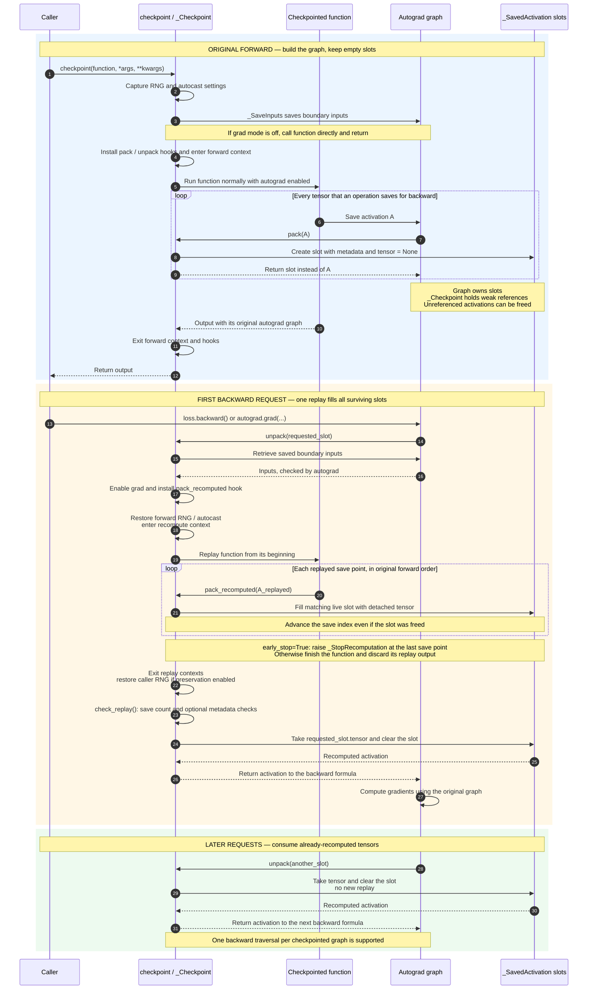
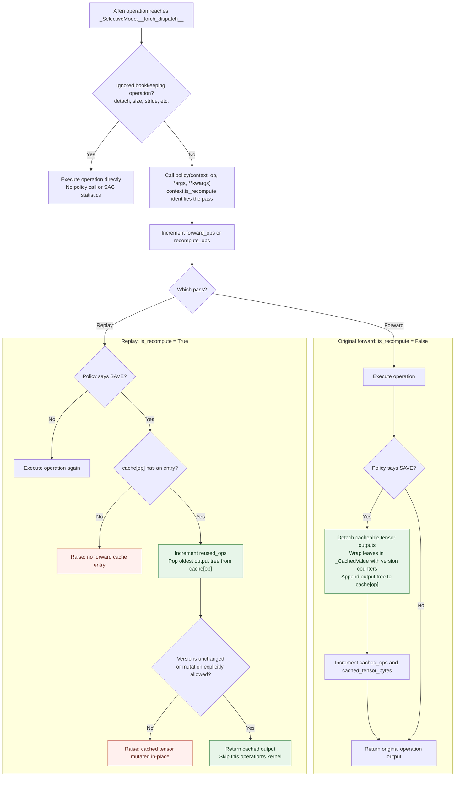

# Activation checkpointing, with the machinery exposed

This is a standalone teaching implementation of PyTorch's modern, non-reentrant
activation checkpoint. It uses core autograd and dispatcher primitives, but the
custom path never calls `torch.utils.checkpoint.checkpoint`.

It is intentionally more realistic than the common custom `autograd.Function`
example. That simple reentrant formulation runs forward under `no_grad()` and
reruns the entire function in backward. Current PyTorch recommends the
non-reentrant implementation, whose interesting mechanism is
`saved_tensors_hooks`.

## The central trick

During a normal forward pass, backward formulas call `save_for_backward` for
the tensors they will need later. The custom checkpoint installs hooks that
replace every such tensor with a tiny `_SavedActivation` slot:

The sequence below separates the original forward, the first backward tensor
request, and later requests. **Replay fills the slots in forward save order;
backward retrieves them in the order its gradient formulas need them.**



For example, in `y = x.sin().cos()`, `sin` saves `x` and `cos` saves
`sin(x)`. Forward creates two empty slots. Backward first needs the second
slot to differentiate `cos`; that request triggers replay, which fills slot 0
and then slot 1. Backward consumes slot 1, then slot 0 to differentiate `sin`.
Early stopping can interrupt replay before the final `cos` output is computed:
its saved input is already available.

`_SaveInputs` anchors only the checkpoint boundary inputs to the outer
autograd graph. On the first unpack, the function is replayed with grad mode
enabled. A second set of saved-tensor hooks catches the replayed activations and
matches them, in order, to the slots from the first pass.

The implementation keeps the less-obvious production behavior that matters for
correctness:

- CPU and accelerator RNG states are forked and restored, so dropout produces
  the same mask during replay without advancing the caller's RNG twice.
- CPU and accelerator autocast settings are replayed.
- Replay verifies the number and shape/dtype/device metadata of saved tensors.
- An internal exception stops replay immediately after the final needed save
  point, instead of necessarily finishing the function.
- Inputs are retained by an autograd node rather than a plain Python closure.

## Selective activation checkpointing

Selective activation checkpointing (SAC) is a layer around the same replay.
Two paired `TorchDispatchMode`s intercept individual ATen operations:

1. The forward mode asks a policy whether an operation should be saved or
   recomputed. Saved outputs go into a per-`OpOverload` FIFO cache.
2. The replay mode asks the same policy with `is_recompute=True`. It either runs
   the operation or pops the corresponding forward result from the cache.
3. Cached tensors retain their version counter. If later code mutates one
   in-place, replay fails instead of silently using a corrupted result.

`MUST_*` versus `PREFER_*` matters to compiler partitioners in full PyTorch. In
this eager-only implementation they have the same runtime behavior, but both
forms remain in the API so the policy reads like the real one.

The demo caches the two batched matrix multiplies in attention while replaying
the cheaper operations:

```python
sac_contexts = create_selective_checkpoint_contexts(
    [torch.ops.aten.bmm.default]
)
output = checkpoint(block, x, context_fn=lambda: sac_contexts)
```

### How SAC changes the replay

AC's slots represent **tensors autograd saves for backward**. SAC's separate
cache holds **outputs of operations selected by the policy**. These are two
different stores: SAC changes how replay obtains operation outputs, while AC
still reconstructs the tensors needed by the original backward graph.

Both contexts returned by `create_selective_checkpoint_contexts` are instances
of `_SelectiveMode`, sharing one cache. The forward context is entered around
the original function; the recompute context is entered around its replay.



Here, SAVE means `MUST_SAVE` or `PREFER_SAVE` (or boolean `True`);
RECOMPUTE means either recompute enum value (or boolean `False`). Statistics
count intercepted operations, so `recompute_ops` includes operations whose
kernels were skipped using the cache.

For `sigmoid(x @ w1 @ w2)` with `aten.mm.default` selected:

| Stage | First matrix multiply | Second matrix multiply | Sigmoid |
|---|---|---|---|
| Original forward | Compute A; append A to `cache[mm]` | Compute B; append B to `cache[mm]` | Compute normally |
| Cache after forward | A is first in the queue | B is second in the same queue | No SAC entry |
| Replay | Pop A; skip kernel | Pop B; skip kernel | Compute again |

The cache is FIFO **per concrete operation overload**, not per source line.
AC's replay hooks still observe autograd save points around those operations,
including when a cached output supplies the result. Once the last save point
is reached, AC can stop replay. SAC therefore trades memory for less replay
compute: selected outputs stay alive across forward and backward.

## Realistic decoder workload

`decoder.py` contains a pre-norm decoder block with RMSNorm, fused QKV
projection, rotary embeddings, explicit causal multi-head attention, residual
dropout, and a SwiGLU MLP. Attention is written explicitly rather than through a
fused SDPA kernel so SAC decisions and operation counts remain visible.

Run all four paths side by side:

```bash
uv sync
uv run python demo.py --device cuda
```

The table reports decoder invocations, CUDA allocated memory, and numerical
differences from eager. The detailed section reports how many autograd tensors
were replaced by empty slots and how many `bmm` results SAC reused.

Run the correctness suite:

```bash
uv run pytest
```

The tests compare outputs, input gradients, and every parameter gradient with
both eager execution and PyTorch's native non-reentrant checkpoint. They also
cover dropout RNG state, early stop, SAC cache reuse, cache mutation detection,
metadata and save-count mismatch errors, no-grad behavior, CUDA bfloat16,
CPU autocast replay, repeated SAC operations against native PyTorch, activation
release, input version checks, and context cleanup on forward failure.

## Reading the implementation

Everything lives in `simple_checkpoint.py`. The public API is unchanged:
`checkpoint`, `create_selective_checkpoint_contexts`, the policy enum, context,
error, and statistics types.

Start with `_Checkpoint`, which holds the three steps of AC in one place:

1. `pack` replaces each saved activation with an empty slot containing metadata.
2. The first `unpack` replays the function. `pack_recomputed` fills the slots in
   forward save order, stopping at the last slot when early stopping is enabled.
3. `unpack` returns the requested tensor and clears its slot, releasing the
   activation as backward consumes it.

Autograd owns the slots; the checkpoint state holds only weak references. This
lets discarded graph branches release their slots without retaining replayed
activations. Each slot stores its tensor directly, with no handle or lookup map.

`checkpoint` captures RNG and autocast settings, saves boundary inputs through
`_SaveInputs`, and calls the function directly inside the forward hooks and
context. Ordinary `with` blocks restore hooks and contexts even if forward
raises. There is no generator driving the forward pass.

For SAC, read `_SelectiveMode.__torch_dispatch__`. The same class serves both
passes: forward computes and caches selected outputs; replay takes the next
cached output from that operation's queue. `_CachedValue` checks for mutation.
The remaining dispatch guard in `_maybe_detach` preserves shared version
counters for aliased outputs; removing it would weaken mutation detection.

The research trail is the current [DeepWiki PyTorch index](https://deepwiki.com/pytorch/pytorch),
the pinned [PyTorch 2.11 checkpoint source](https://github.com/pytorch/pytorch/blob/v2.11.0/torch/utils/checkpoint.py),
the [checkpoint API documentation](https://docs.pytorch.org/docs/stable/checkpoint.html),
and PyTorch's [activation-checkpointing techniques overview](https://pytorch.org/blog/activation-checkpointing-techniques/).

## Deliberate boundaries

The code is faithful to the eager mechanism, not a drop-in production clone.
PyTorch additionally handles overlapping and repeated backward graph tasks,
nested checkpoints, `torch.compile` annotations, debug operator traces,
arbitrary accelerator backends, global device contexts, and more elaborate
error reporting. PyTorch 2.11 also exposes CPU-offload policy values; this
example focuses on the save-versus-recompute SAC mechanism. The standalone
implementation therefore supports eager execution and one backward traversal
per checkpointed graph.

The implementation was independently reduced from PyTorch's BSD-licensed
checkpoint module; see `THIRD_PARTY_NOTICE.md`.
