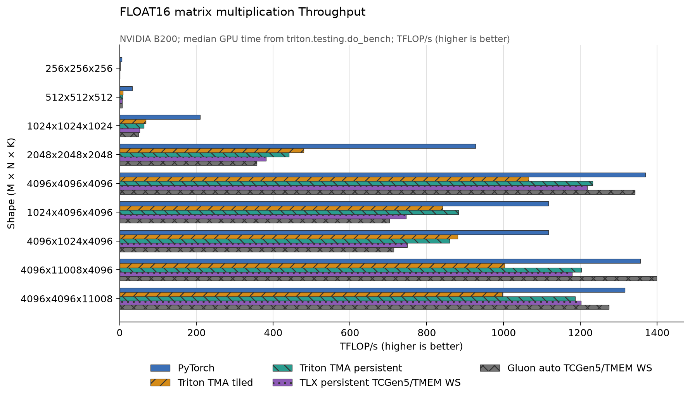
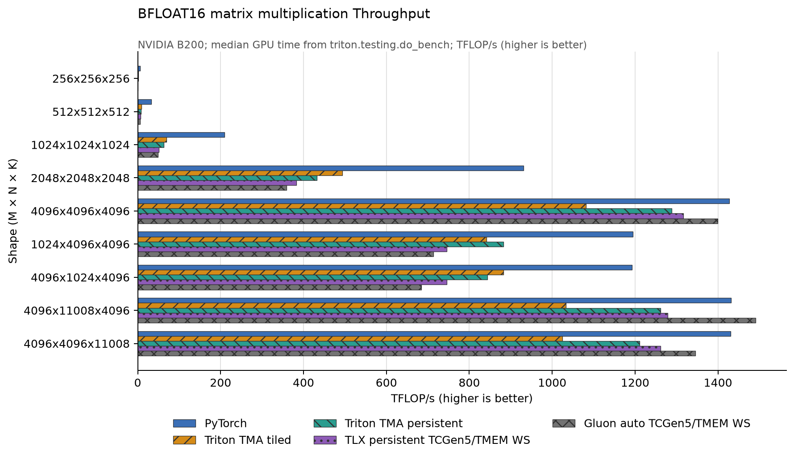
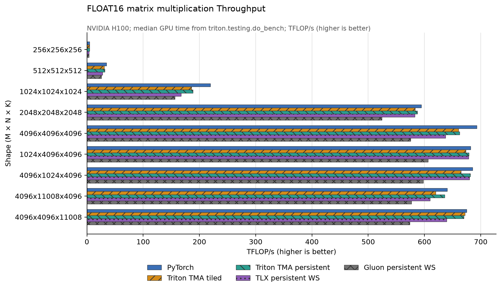
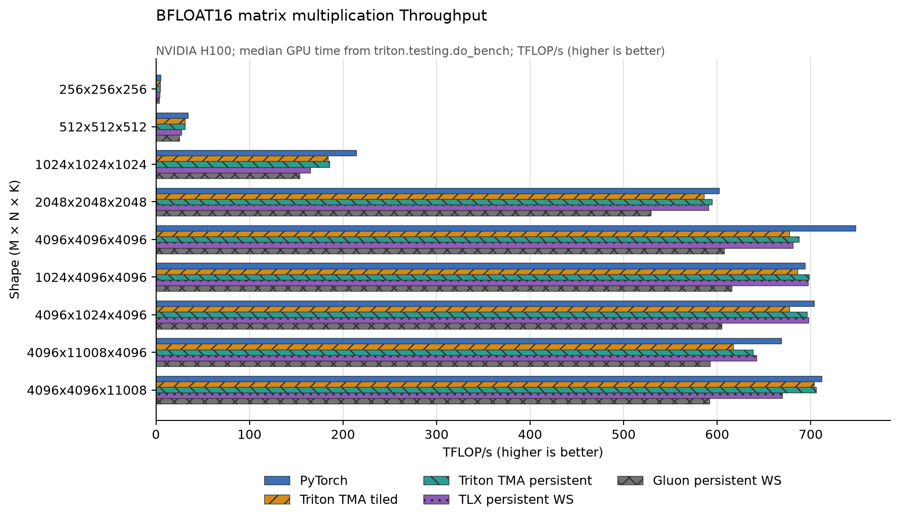

# Matmul lab: Triton TMA, TLX, and Gluon on Hopper and Blackwell

This project implements `C[M, N] = A[M, K] @ B[K, N]` five ways: a PyTorch/cuBLAS reference and four optimized study kernels. Every custom kernel owns the complete K reduction for its output tile. There is no split-K grid, partial workspace, atomic accumulation, or reduction kernel.

## Kernels

| File | Scheduling | Data movement / compute | Warp specialization |
|---|---|---|---|
| `triton_tma_matmul.py` | One program per output tile; grouped ordering; autotuned | Host TMA descriptors, FP32 `tl.dot` accumulation | Compiler-managed `tl.range(..., warp_specialize=True)` on SM100+ |
| `triton_tma_persistent_matmul.py` | SM-stride persistent tiles; grouped ordering; subtiled epilogue | Host TMA descriptors, FP32 `tl.dot` accumulation | Compiler-managed persistent loop with `warp_specialize=True` on SM100+ |
| `tlx_matmul.py` | SM-stride persistent tiles | One TMA producer plus two replicated four-warp WGMMA consumers | Explicit `tlx.async_tasks` on Hopper |
| `gluon_matmul.py` | Grouped SM-stride persistent tiles | Three-stage TMA pipeline, four-warp WGMMA, overlapped previous-tile TMA store | Native `gl.warp_specialize` loader/compute partitions on Hopper |
| `blackwell/tlx_matmul.py` | Grouped SM-stride persistent tiles | Four-stage TMA pipeline, TCGen5 MMA, double-buffered FP32 TMEM | Explicit TMA/MMA/epilogue `tlx.async_tasks` partitions on SM100+ |
| `blackwell/gluon_matmul.py` | Shape-dispatched persistent tiles | One-CTA four-stage TMA or two-CTA multicast/CLC pipeline, TCGen5 MMA, double-buffered FP32 TMEM | Native three- or four-way `gl.warp_specialize` on SM100+ |
| `blackwell/gluon_matmul_2cta.py` | Two-CTA clusters with CLC work stealing | Six-stage multicast TMA, collaborative TCGen5 MMA, double-buffered FP32 TMEM | Dedicated epilogue, TMA, MMA, and CLC partitions on SM100+ |
| `reference.py` | PyTorch | `torch.matmul` / cuBLAS | N/A |

`benchmark.py` deliberately calls the two Triton `warp_specialized_matmul`
wrappers on SM100+, so the measured Blackwell rows always pass
`warp_specialize=True`; they do not rely on the default. It automatically
selects the TCGen5/TMEM TLX and Gluon rewrites on compute capability 10.0 or
newer. Blackwell Gluon additionally selects its two-CTA multicast kernel when
`M`, `N`, and `K` are all at least 4096; smaller or skinny shapes retain the
lower-overhead one-CTA kernel. On SM90 it selects the original WGMMA kernels,
while Triton uses its software-pipelined TMA path because compiler-managed warp
specialization is a Blackwell feature.

## Reproducible UV environment

Prerequisites are `uv`, Git, a C++ toolchain, and a recent NVIDIA CUDA driver.
Use an H100 for all Hopper implementations or a B200 for the Blackwell paths.

```bash
cd /path/to/MLSys-Experiments/triton/matmul_triton_tlx
./bootstrap.sh
```

The bootstrap script:

1. installs managed CPython 3.12;
2. checks out the exact Triton commit required by `triton-utlx==3.7.1` under `.deps/triton`;
3. applies `patches/triton-tlx-warp-specialization.patch`;
4. creates `.venv`, resolves the locked PyTorch/TLX/plotting dependencies, and builds extension-enabled Triton;
5. smoke-tests the TLX compiler plugin.

The source patch exports the existing TMA/warp-specialization bindings needed
by TLX and adds the missing TLX-to-native Blackwell TMEM-load bridge. The
bridge runs only for SM100+ after TLX has resolved register layouts.
`tlx_plugin.py` contains the matching frontend compatibility shims and keeps
Gluon on its native compiler pipeline.

The SM90 path is intentionally isolated from the Blackwell additions:

- H100 imports the top-level TLX/Gluon WGMMA kernels and retains TLX's original
  SM90 compiler stages.
- B200 imports only the `blackwell/` TLX/Gluon implementations and enables the
  SM100-specific placeholder-layout and TMEM-load passes.
- Triton selects `warp_specialize=False` on H100 and the explicit
  `warp_specialized_matmul` wrapper on B200.

## Run individual kernels and combined benchmarks

`benchmark.py` accepts `--provider` with `pytorch`, `triton-tma`,
`triton-persistent`, `tlx`, `gluon`, or `all`. On Blackwell it additionally
accepts `gluon-1cta`, `gluon-2cta`, and `gluon-compare`. `gluon` exercises the
shape-aware dispatcher; `gluon-compare` plots it alongside both forced CTA
variants.

Run one implementation, including its correctness checks:

```bash
uv run python benchmark.py --provider triton-tma --suite quick --dtype fp16 --output results/individual/triton-tma
uv run python benchmark.py --provider triton-persistent --suite quick --dtype fp16 --output results/individual/triton-persistent
uv run python benchmark.py --provider tlx --suite quick --dtype fp16 --output results/individual/tlx
uv run python benchmark.py --provider gluon --suite quick --dtype fp16 --output results/individual/gluon
uv run python benchmark.py --provider gluon-1cta --suite quick --dtype fp16 --output results/individual/gluon-1cta
uv run python benchmark.py --provider gluon-2cta --suite quick --dtype fp16 --output results/individual/gluon-2cta
uv run python benchmark.py --provider gluon-compare --suite full --dtype fp16 --skip-check --output results/blackwell/gluon-compare
uv run python benchmark.py --provider pytorch --suite quick --dtype fp16 --output results/individual/pytorch
```

Use `--suite full`, `--dtype bf16`, or `--skip-check` with any individual
provider in the same way.

Run all providers together. This works unchanged on H100 and B200; choose the
output directory name for the machine being measured:

```bash
uv run python benchmark.py --provider all --suite quick --dtype fp16 --output results/current-gpu/quick
```

Full combined FP16 and BF16 sweeps:

```bash
uv run python benchmark.py --provider all --suite full --dtype fp16 --skip-check --output results/current-gpu/fp16
uv run python benchmark.py --provider all --suite full --dtype bf16 --skip-check --output results/current-gpu/bf16
```

Each sweep records median/20th/80th-percentile GPU timing, TFLOP/s, CSV data, Triton's tutorial plot, and a readable grouped horizontal-bar plot. Providers run sequentially so they do not contend for the GPU.

## Measured B200 results

These checked-in measurements were run on an NVIDIA B200 (compute capability
10.0). Selected median throughput is shown in TFLOP/s:

| dtype / M×N×K | cuBLAS | Triton TMA WS | Triton persistent WS | TLX TCGen5/TMEM | Gluon auto TCGen5/TMEM |
|---|---:|---:|---:|---:|---:|
| FP16 / 4096×4096×4096 | 1369.6 | 1065.0 | 1232.1 | 1218.1 | 1341.8 |
| FP16 / 4096×11008×4096 | 1356.5 | 1002.2 | 1202.6 | 1178.1 | 1398.3 |
| FP16 / 4096×4096×11008 | 1316.0 | 996.6 | 1186.8 | 1202.1 | 1274.3 |
| BF16 / 4096×4096×4096 | 1427.4 | 1082.1 | 1288.2 | 1316.7 | 1399.0 |
| BF16 / 4096×11008×4096 | 1431.4 | 1033.3 | 1261.1 | 1278.7 | 1490.3 |
| BF16 / 4096×4096×11008 | 1430.5 | 1024.7 | 1210.4 | 1261.2 | 1345.5 |

Full data: `results/blackwell/fp16/*.csv` and
`results/blackwell/bf16/*.csv`.

Forced one-CTA/two-CTA comparisons are under `results/blackwell/gluon-2cta-*`.
They show why dispatch is necessary: cluster coordination loses on shapes up
through 2048-square and on the 1024-wide/tall cases, while multicast operand
reuse wins on the three large shapes selected by the dispatcher.





## Measured H100 results

Selected median throughput from the checked-in full sweeps (TFLOP/s):

| dtype / M×N×K | cuBLAS | Triton TMA | Triton persistent | TLX WS | Gluon WS |
|---|---:|---:|---:|---:|---:|
| FP16 / 4096×4096×4096 | 692.8 | 660.6 | 662.5 | 637.2 | 575.2 |
| FP16 / 1024×4096×4096 | 681.7 | 673.6 | 679.2 | 678.7 | 606.6 |
| FP16 / 4096×11008×4096 | 640.6 | 620.0 | 635.8 | 609.8 | 576.6 |
| BF16 / 4096×4096×4096 | 747.7 | 677.4 | 687.5 | 680.8 | 607.6 |
| BF16 / 4096×4096×11008 | 711.9 | 703.4 | 706.0 | 669.8 | 591.8 |

Full data: `results/fp16/*.csv` and `results/bf16/*.csv`.





## Scope and reading order

- Inputs are contiguous row-major FP16 or BF16; accumulation is FP32 and output uses the input dtype.
- Positive arbitrary `M/N/K` are supported. The wrappers transparently pad TMA's contiguous K/N dimensions to 16 elements and crop the output; aligned benchmark shapes do not pay this cost.
- Start with `reference.py`, then read the tiled Triton kernel, persistent Triton kernel, TLX producer/consumer kernel, and Gluon partition functions. Finish with `benchmark.py`.
- Useful follow-ups: fuse bias/ReLU, accept transposed B, add batched GEMM, inspect TTGIR/PTX/SASS, profile barrier stalls, and explain why persistent scheduling or grouped tile order can help or hurt L2 reuse.

The implementations follow the official [Triton persistent matmul tutorial](https://github.com/triton-lang/triton/blob/main/python/tutorials/09-persistent-matmul.py), [Gluon Blackwell warp-specialization tutorial](https://github.com/triton-lang/triton/blob/main/python/tutorials/gluon/08-warp-specialization.py), [Gluon multi-CTA tutorial](https://github.com/triton-lang/triton/blob/main/python/tutorials/gluon/14-multicta.py), [Gluon WGMMA tutorial](https://triton-lang.org/main/getting-started/tutorials/gluon/wgmma.html), and the [TLX Blackwell TCGen5/TMEM design](https://pytorch.org/blog/tlx-block-attention-a-warp-specialized-blackwell-kernel-for-fixed-block-sparse-self-attention/).
